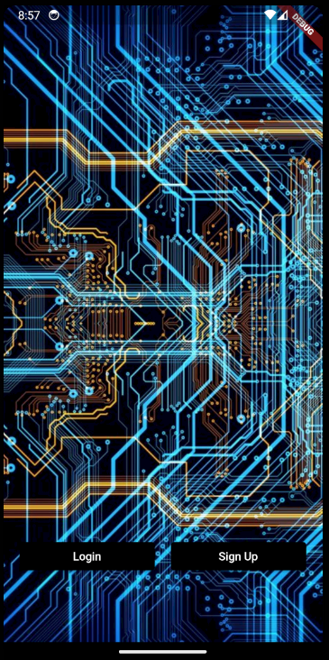

# SortYourLife
The app is designed to help organize daily finances and keep track of them. The backend is implemented using the Django framework, while the frontend is built with Flutter. There is both an offline and an online database, which synchronize with each other depending on the app's status. The online database serves as the primary database, storing all data, while the offline database keeps only essential data stored separately on the device.

The app features user registration, login/logout functionality, and the ability to record transactions, both positive income and negative expenses. Users can also define multiple accounts and categories for both income and expenses. The same applies to budgets, with the option to set a time frame for them. The home screen presents a graphical representation of income and expenses.

## Login

## Register

## Password

## Home

## Income

## Outgoing

## Bank Accounts

## Fix costs

